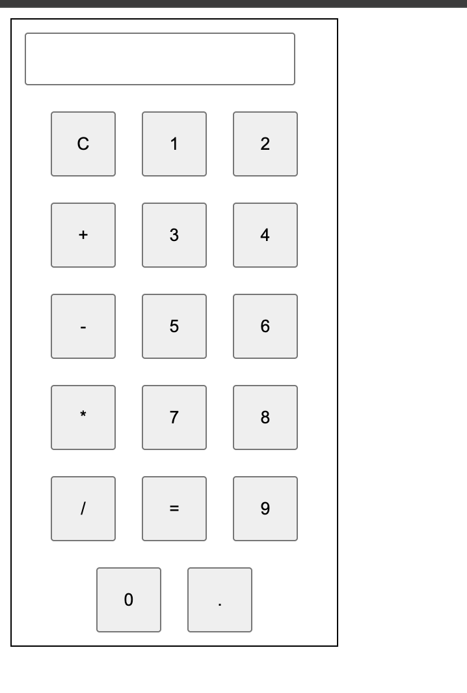

# 🧮 Simple Calculator

A basic calculator built using **HTML, CSS, and JavaScript**.  
It performs simple arithmetic operations like **Addition, Subtraction, Multiplication, and Division** with a clean and responsive UI.

---

## 🚀 Features
- ➕ Addition  
- ➖ Subtraction  
- ✖️ Multiplication  
- ➗ Division  
- 🖥️ Responsive design (works on different screen sizes)  
- 🎨 Simple and clean UI  

---

## 📂 Project Structure
Calculator/
│── calculator.html # Main HTML file
│── calculator.css # Styling file

---

## 📸 Screenshot

Here’s how the calculator looks:

---

Start calculating ✅
LIVE DEMO:http://127.0.0.1:5500/calculator.html

🛠️ Tech Stack
HTML5

CSS3

JavaScript

